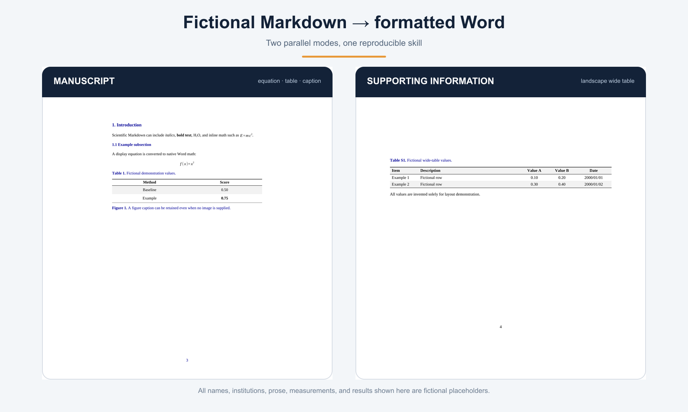

# FengDoc Foundry

FengDoc Foundry packages a reproducible scientific Markdown-to-Word workflow as a Codex skill.



## Scope

- Designed and tested for OpenAI Codex.
- Other models, agent frameworks, and runtime environments have not been tested.
- For personal use only.
- An agent may invoke manuscript mode or Supporting Information mode according to the task.

## Two-mode workflow

### Manuscript mode

Convert semantic Markdown into a scholarly manuscript with front matter, abstract and numbered headings, native Word equations, tables, captions, page breaks, and continuous page numbers.

### Supporting Information mode

Convert supplementary Markdown into a Supporting Information document with cover styles, `Discussion S#` and `Method S#` sections, figures, procedural subheadings, specialized image sizing, wide landscape tables, and continuous page numbers across sections.

## Demo

All demo names, institutions, prose, measurements, dates, and results are fictional placeholders.

- [Minimal manuscript Markdown](demo/minimal-manuscript.md)
- [Minimal Supporting Information Markdown](demo/minimal-supporting.md)
- [Generated manuscript DOCX](demo/minimal-manuscript.docx)
- [Generated Supporting Information DOCX](demo/minimal-supporting.docx)
- [Rendered demo preview](assets/demo-flow.png)

Generate the Word outputs:

```bash
python3 scripts/md2doc.py --type manuscript \
  demo/minimal-manuscript.md demo/minimal-manuscript.docx

python3 scripts/md2doc.py --type supporting \
  demo/minimal-supporting.md demo/minimal-supporting.docx
```

## Requirements

- Python 3 with `python-docx` and `lxml`
- Pandoc available on `PATH`

Install the Python dependencies:

```bash
python3 -m pip install -r requirements.txt
```
